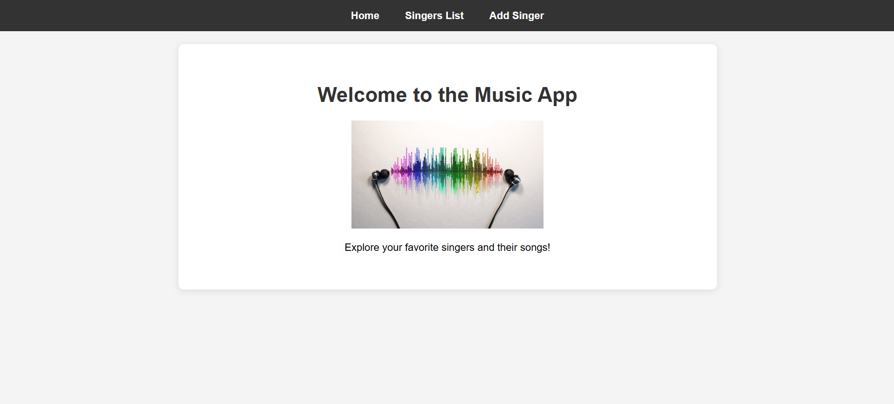

# Singers and Songs Listing Application

## Table of Contents
- [Singers and Songs Listing Application](#singers-and-songs-listing-application)
  - [Table of Contents](#table-of-contents)
  - [Overview](#overview)
  - [Key Highlights](#key-highlights)
  - [User Interface](#user-interface)
  - [Features](#features)
  - [Tools and Technologies Used](#tools-and-technologies-used)
    - [Frontend](#frontend)
    - [Backend](#backend)
    - [Database](#database)
    - [Containerization](#containerization)
    - [Orchestration](#orchestration)
    - [CI/CD](#cicd)
    - [Monitoring](#monitoring)
    - [Testing](#testing)
    - [Automation](#automation)
  - [Installation and Setup](#installation-and-setup)
    - [Prerequisites](#prerequisites)
    - [Steps to Install and Setup](#steps-to-install-and-setup)
  - [Conclusion](#conclusion)
  - [Future Enhancements](#future-enhancements)

## Overview
The Singers and Songs Listing Application is a dynamic platform where users can browse, create, and manage their favorite music artists and their popular songs. Built with a React-based frontend and a Python Flask API backend, the application leverages modern DevOps practices for seamless deployment, scalability, and monitoring.
With a single push to the feature branch, the application life-cycle is being automated so the changes will be reflected at your live application.

## Key Highlights
- **Containerized Architecture**: Deployed using Docker for environment consistency and portability.
- **Security in mind**: the frontend is using a reverse proxy to communicate with the isolated backend container inside the cluster.
- **CI/CD Pipelines**: Integrated with Jenkins and ArgoCD for automated builds, testing, and deployments.
- **Kubernetes Orchestration**: Deployed on Kubernetes for scalability, high availability, and efficient resource management.
- **Helm Charts**: Simplifies Kubernetes deployments with parameterized Helm charts.
- **Dynamic Pods**: Application scales dynamically in the Kubernetes cluster based on load.
- **Monitoring and Visualization**: Application performance and metrics are monitored via Prometheus and Grafana.
- **MongoDB Integration**: Efficient storage and retrieval of singer and song information.
- **Unit Testing**: Ensures backend stability with test cases implemented in Python.
- **Shell Scripting**: Automates infrastructure setup and credential management for CI/CD tools.

## User Interface
- Browse the list of singers and songs.
- Add new singers and their songs.
- Edit or delete existing entries.


## Features
- **Singers and Songs Listing**: View an extensive list of singers and their most popular songs.
- **Add or Edit Songs**: adding or updating singer/song details.
- **Responsive UI**: A seamless, user-friendly React-based frontend.
- **API Integration**: The backend API provides fast and reliable data retrieval using Flask.
- **Dynamic Kubernetes Pods**: Application scales automatically based on user demand.
- **CI/CD Integration**: Jenkins ensures automated builds, testing, and deployments, while ArgoCD manages GitOps-style deployments.
- **Monitoring**: Track application performance and resource usage via Prometheus and Grafana.
- **Testing Framework**: Backend stability ensured with Python unit tests.

## Tools and Technologies Used
### Frontend
- **React (.jsx)**: Provides a dynamic and interactive user interface.

### Backend
- **Python Flask**: Serves as the backend API to manage singer and song data.

### Database
- **MongoDB**: Stores and retrieves singer and song information efficiently.

### Containerization
- **Docker**:
  - Dockerfile for containerizing the application.

### Orchestration
- **Kubernetes**: Manages container deployment and scaling.
- **Helm**: Simplifies Kubernetes configuration with parameterized values.yaml and reusable templates.

### CI/CD
- **Jenkins**: Automates the CI/CD pipeline through a Jenkinsfile.
- **ArgoCD**: Provides continuous deployment to the Kubernetes cluster using GitOps.

### Monitoring
- **Prometheus & Grafana**: Monitors and visualizes application performance and infrastructure metrics.

### Testing
- **Unit Testing**: Pre-built tests using Python (test_app.py) ensure backend stability.

### Automation
- **Shell Scripts**:
  - infra.sh: Automates infrastructure setup.
  - getPasswords.sh: Manages Jenkins and ArgoCD credentials.
  - init_mongodb.sh: Creating a new music database with credentials and initial data. 
  
## Installation and Setup
### Prerequisites
Ensure the following tools are installed on your machine:
- Python
- Docker
- Kubernetes CLI (kubectl)
- Helm
- Bash

### Steps to Install and Setup
1. **Clone the Repository**
   ```bash
   git clone https://github.com/danielbiton342/k8s-application-lifecycle.git

   cd k8s-application-lifecycle
   ```

2. **Prepare the Infrastructure**
   ```bash
   chmod +x infra.sh
   ./infra.sh
   ```
   This will:
   - Install Jenkins for CI/CD pipeline management.
   - Deploy ArgoCD for continuous delivery.
   - Set up Prometheus and Grafana for monitoring.
3. **Set up new database**
   
   Set the environment variable for the MongoDB password.
   Replace your_secure_password_here with a strong, secure password.
   ```bash
    export BACKEND_APP_PASSWORD="your_secure_password_here"
   ``` 
   Now run the init_mongodb.sh script:

   ```bash
   chmod +x init_mongodb.sh
   ./init_mongodb.sh
   ```
   This will:
   - retrieve the BACKEND_APP_PASSWORD env variable
   - Create a job as a temporary pod MongoDB initialization
4. **Set Up Jenkins**
   - Access the Jenkins UI (http://<Jenkins-URL>:8080) and set up a Multibranch Pipeline for your Git repository.

5. **Configure ArgoCD**
   - Access the ArgoCD UI (http://<ArgoCD-URL>:80) and configure the repository details.
   - Modify the cicd/application.yaml file for your specific repository settings (e.g., URL, branch, or paths).

6. **Deploy the Application**
   ```bash
   kubectl apply -f cicd/application.yaml
   ```
   This will deploy the application and its resources to the cluster.

7. **Access the Application**
   - Once deployed, the application will be accessible via the Kubernetes LoadBalancer or NodePort service.
   - Visit http://localhost:30000 or the corresponding NodePort to access the frontend.

## Conclusion
The Singers and Songs Listing Application combines a modern UI, robust backend, and DevOps best practices to deliver a scalable and feature-rich platform. By leveraging containerization, orchestration, and CI/CD tools, the application ensures smooth deployment, scalability, and performance monitoring in cloud-native environments.

## Future Enhancements
- Integrate additional APIs for enhanced song metadata.
- Add role-based access control (RBAC) for better user management.
- Implement automated end-to-end testing.

---

